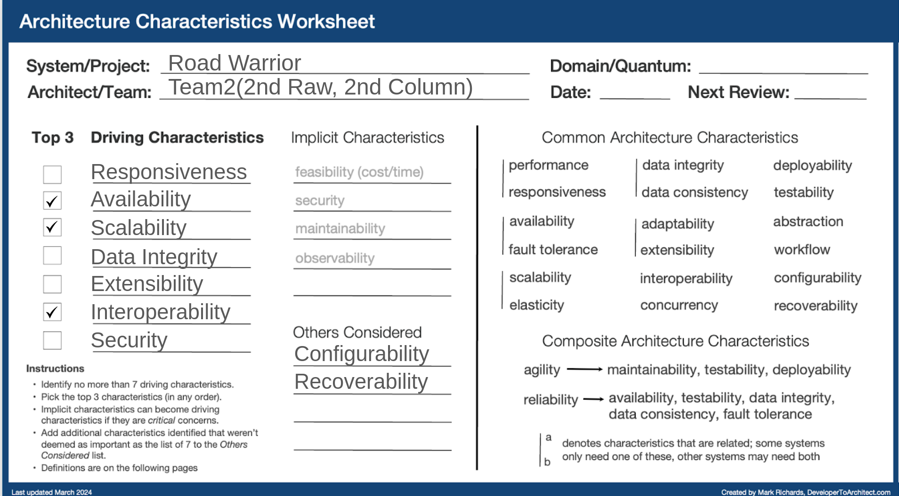

# Architecture Characteristics Worksheet

---

### Driving Characteristic: Security (implicit)

#### (The ability of the system to restrict access to sensitive information or functionality)

**Reason:** 
User's personal and financial data should not be accessible by unauthorized person.(e.g., frequent flyer numbers, credit card info)

**Use Case:** 
A user logs in from a new device. The system should verify their identity (e.g., 2FA authentication) before displaying their travel details to prevent unauthorized access.

---

### Driving characteristic: Responsiveness

#### (The amount of time it takes to get a response to the user)

**Reason:** 
With reference to Requirement (2), users need real-time access to their reservations. Delays in fetching trip details from third-party systems should be minimized to ensure a smooth experience.

**Use Case:** 
A user at an airport needs to quickly check their flight details before boarding. If the dashboard takes too long to load, they may miss crucial flight updates.

---

### Driving Characteristic: Availability

#### (The amount of uptime of a system; usually measured in 9's (e.g., 99.9%))

**Reason:** 
With reference to Requirement (1) where “The system must interface with the agency’s existing airline, hotel, and car rental interface system to automatically load reservations.”

The system must be available 24/7 globally to ensure users can access their trip details at any time. If the system is unavailable, travelers may miss critical information about flights, hotels, or car rentals, causing major disruptions.

**Use Case:** 
Lets say, a traveler arrives at their hotel and needs to show their booking confirmation to check in. If the system is down, they may face issues at the hotel reception. Ensuring high availability minimizes the risk of such disruptions.

---

### Driving Characteristic: Scalability

#### (A function of system capacity and growth over time; as the number of users or requests increase in the system, responsiveness, performance, and error rates remain constant)

**Reason:** 
With reference to the 10,000+ registered users worldwide, the system must scale to handle increased load, especially during peak travel seasons.

If the architecture does not support scaling, performance degradation may occur, leading to slow load times or failed requests.

**Use Case:** 
During holiday travel periods, user traffic spikes significantly. A scalable system ensures new and existing users can retrieve and manage their bookings without performance delays.

---

### Driving Characteristic: Data integrity

#### (The data across the system is correct and there is no data loss in the system)

**Reason:** 
With reference to Requirement (1), the system should ensure that imported and manually added reservations are accurate and not duplicated or lost.

**Use Case:** 
A traveler books a car rental and a hotel but later modifies the hotel reservation. The system should reflect the updated booking details accurately.

---

### Driving Characteristic: Extensibility

#### (The ease in which a system can be extended with additional features and functionality)

**Reason:** 
Future enhancements such as new travel partners, loyalty programs, or additional services should be easy to integrate without major system rework.

**Use Case:** 
The agency partners with a new airline that provides exclusive discounts wants to be part of the system. The system should allow easy integration of the new airline’s booking system.

---

### Driving Characteristic: Interoperability

#### (The ability of the system to interface and interact with other systems to complete a business request)

**Reason:** 
With reference to Requirement (1), the system must integrate with airlines, hotels, and car rental services via their APId to automatically import reservations.

To avoid manual data entry by users, the system should support multiple travel partners and formats, ensuring seamless data retrieval and synchronization.

**Use Case:** 
A user books a flight with an airline and a hotel through a different booking service. The system should automatically pull both reservations and organize them under the same trip in the dashboard.

---

### Driving Characteristic: Recoverability

#### (The ability of the system to start where it left off in the event of a system crash)

**Reason:** 
With reference to the requirement for high availability, in the event of a server failure or data corruption, the system should recover without losing user data.

**Use Case:** 
A traveler is updating their trip plan when the system crashes. When the system restarts, the changes they made should still be saved so they don't lose their progress and avoid any inconvenience.

---

### Driving Characteristic: Configurability

#### (The ability of the system to support multiple configurations, as well as support custom on-demand configurations and configuration updates)

**Reason:** 
Users may prefer different ways to view and manage trips, such as filtering by airline, trip duration, or price.

**Use Case:** 
A business traveler wants to only see upcoming trips while hiding completed trips. The dashboard should allow them to customize their view preferences.

---

### Conclusion

By focusing on these nine architectural characteristics, the Road Warrior system should ensure a fast, secure, scalable, and highly available travel management experience for users worldwide.
